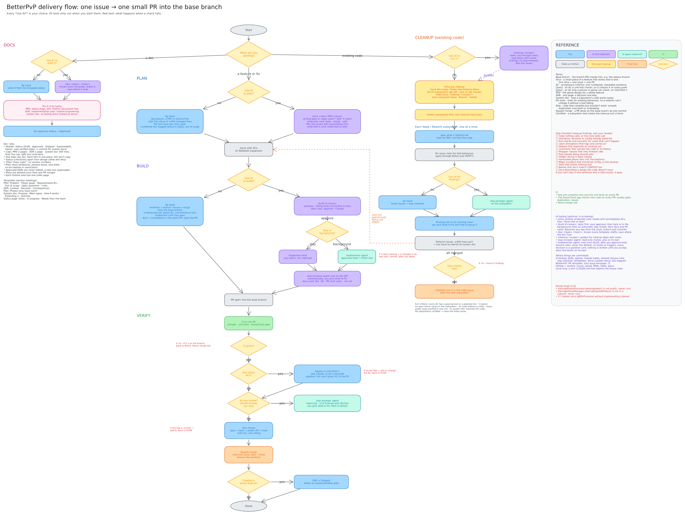

# AI tooling

Claude Code tooling and system docs for BetterPvP, shared across machines and the team.



The editable diagram is at https://draw.brauw.dev/editor/1402245d-a973-49f7-b884-d83ee368f510. Update
`delivery-flow.png` with an export when it changes.

## Install

Needs Python 3.12+ and the GitHub CLI logged in (`gh auth status`).

```bash
git clone https://github.com/BetterPvP/ai-tooling.git
python ai-tooling/install.py <path to the BetterPvP checkout>
```

This links everything into the checkout and keeps it out of the checkout's git. Run it again after pulling. Then make
sure the checkout's `CLAUDE.md` imports the house rules with the line `@.claude/shared/house-rules.md`.

## Layout

| Folder | Becomes | Holds |
|---|---|---|
| `skills/<name>/` | `.claude/skills/<name>` | `/slice`, `/build`, `/doc`, `/cleanup`, and the project skills |
| `agents/` | `.claude/agents` | `slop-reviewer`, `implementer`, and the project agents |
| `shared/` | `.claude/shared` | house rules, slop checklist, doc templates, `project.json`, `board.py`, `deploy.py` |
| `tools/<name>/` | `.claude/<name>` | scripts, plus an optional `settings.json` (Claude hooks) and `git-hooks/` |
| `docs/` | `docs/` | the system docs |

Edits made through the checkout land in this repo. Commit them here.

## Config

`shared/project.json` sets the repo, the base branch (change `base` when the season branch changes), the PR size
limit, the board and its status ids, and the projects to take new issues off.

For deploys, set `PTERODACTYL_API_KEY`, or sign in to the 1Password CLI with access to
`op://Claude/pterodactyl-betterpvp/credential`.
